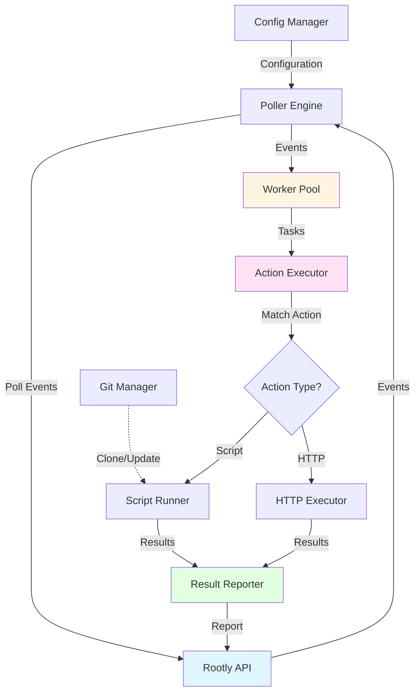

# Rootly Edge Connector (REC)

**Binary name:** `rootly-edge-connector` (also known as REC)

A high-performance, production-ready edge connector for Rootly that polls events and executes automated actions via scripts or HTTP requests. Built with Go for maximum performance and portability.

## Features

- **Event-driven automation**: Poll events from Rootly API and trigger actions automatically
- **Multiple action types**:
  - **Script actions**: Execute shell, Python, PowerShell, Ruby, Node.js, or Go scripts
  - **HTTP actions**: Make HTTP/REST API calls with template support
- **Callable actions**: Register actions with backend to trigger from Rootly UI
- **Flexible triggers**: Actions can trigger on single or multiple event types
- **Command-line flags**: Pass flags to scripts (e.g., `--verbose`, `--format=json`)
- **Git integration**: Automatically clone and update scripts from Git repositories
- **Worker pool**: Concurrent event processing with configurable parallelism
- **Liquid template engine**: Powerful templating with array access (`{{ services[0].name }}`), filters (`{{ services | map: "name" | join: ", " }}`), and 50+ built-in filters
- **Retry logic**: Exponential or linear backoff for API errors
- **Security**: Path validation, script timeouts, and environment isolation
- **Structured logging**: JSON/text/colored output with log rotation
- **Prometheus metrics**: Built-in metrics server for monitoring (12 metrics)
- **Single binary**: No runtime dependencies, cross-platform support

## Quick Start

### Prerequisites

- Go 1.24+ (for building from source)
- Rootly API key

### Installation

#### From Source

```bash
# Clone repository
git clone https://github.com/rootlyhq/rootly-edge-connector.git
cd rootly-edge-connector

# Build
make build

# Install (optional)
make install
```

#### Using Go Install

```bash
go install github.com/rootlyhq/rootly-edge-connector/cmd/rec@latest
```

#### Systemd Installation (Linux)

For production Linux deployments with systemd:

See [docs/systemd-installation.md](docs/systemd-installation.md) for complete installation guide.

Quick start:
```bash
sudo cp docs/rootly-edge-connector.service /etc/systemd/system/
sudo systemctl daemon-reload
sudo systemctl enable --now rootly-edge-connector
```

### Configuration

1. Copy example configuration files:

```bash
# For production deployment
cp config.example.yml config.yml

# For local development (see docs/development.md)
cp config.example.dev.yml config.yml

# Actions (same for all environments)
cp actions.example.yml actions.yml
```

2. Edit `config.yml`:

```yaml
app:
  name: "rootly-edge-connector"

rootly:
  api_url: "https://rec.rootly.com"
  api_key: "${REC_API_KEY}"          # Token starts with rec_ (get from Edge Connectors UI)
```

3. Validate your configuration:

```bash
# Validate config and actions before starting
./bin/rootly-edge-connector --validate -config config.yml -actions actions.yml
```

This will check:
- Configuration file syntax and required fields
- Actions configuration validity
- Parameter definitions schema compliance
- Script file existence (for local scripts)
- Shows a nice summary of all configured actions

4. Define actions in `actions.yml`:

```yaml
# Automatic action (runs on every alert.created)
on:
  alert.created:
    script: /opt/scripts/handle-alert.sh
    parameters:
      host: "{{ data.host }}"
      service: "{{ services[0].name }}"

# Callable action (user triggers from UI)
callable:
  restart_service:
    name: Restart Service
    trigger: alert.action_triggered
    script: /opt/scripts/restart.sh
    parameter_definitions:
      - name: service_name
        type: string
        required: true
```

### Running

```bash
# Set API key
export REC_API_KEY="your-api-key"

# Validate configuration first (recommended)
./bin/rootly-edge-connector --validate -config config.yml -actions actions.yml

# Run connector
./bin/rootly-edge-connector -config config.yml -actions actions.yml
```

### Command-Line Flags

```
--config    Path to configuration file (default: config.yml)
--actions   Path to actions configuration (default: actions.yml)
--validate  Validate configuration and exit (shows nice summary)
--version   Show version and exit
```

## Action Types

### Script Actions

Execute local or Git-based scripts:

```yaml
# Automatic action
on:
  incident.created:
    script: /opt/scripts/check.py
    parameters:
      incident_id: "{{ id }}"
      title: "{{ title }}"
    timeout: 300

# Callable action
callable:
  run_diagnostic:
    name: Run Diagnostic
    script: /opt/scripts/check.py
    trigger: incident.action_triggered
    parameter_definitions:
      - name: check_type
        type: list
        options: [quick, full]
```

### HTTP Actions

Make HTTP/REST API calls with template support or auto-built bodies:

```yaml
# Automatic HTTP action
on:
  incident.created:
    http:
      url: "https://api.example.com/tickets"
      method: POST
      headers:
        Authorization: "Bearer {{ env.API_TOKEN }}"
        Content-Type: application/json
      body: |
        {
          "title": "{{ title }}",
          "severity": "{{ severity.name }}"
        }

# Callable HTTP action
callable:
  send_webhook:
    name: Send Webhook
    http:
      url: "https://hooks.example.com/webhook"
      method: POST
      headers:
        Content-Type: application/json
      body: '{"message": "{{ parameters.message }}"}'
    parameter_definitions:
      - name: message
        type: string
        required: true
```

### Git-Based Actions

Automatically clone and update scripts from Git:

```yaml
- name: ansible_playbook
  type: script
  source_type: git
  script: playbooks/remediation.yml
  trigger:
    event_type: "alert.created"
  git_options:
    url: "git@github.com:org/automation.git"
    private_key_path: "/etc/rootly-edge-connector/ssh/id_rsa"
    branch: "main"
    poll_interval_sec: 300
  timeout: 600
```

### Callable Actions

Actions with `action_triggered` event types are automatically registered with the backend, making them available in the Rootly UI for manual triggering.

**Simple example (single event type):**

```yaml
- id: restart_service
  name: "Restart Service"
  description: "Restart a service"  # Shown in UI
  type: script
  script: /opt/scripts/restart-service.sh
  trigger:
    event_type: "alert.action_triggered"  # Single event type
    # action_name is optional - automatically uses "restart_service" from id

  parameter_definitions:
    - name: service_name
      type: string
      required: true
      description: "Name of the service to restart"

  parameters:
    service_name: "{{ parameters.service_name }}"  # User input
    triggered_by: "{{ triggered_by.email }}"       # Who triggered it

  timeout: 300
```

**Advanced example (multiple event types):**

```yaml
- id: deploy_hotfix
  name: "Deploy Hotfix"
  description: "Deploy a hotfix to production"
  type: script
  script: /opt/scripts/deploy.sh
  trigger:
    event_types:  # Triggers from alerts, incidents, OR standalone
      - "alert.action_triggered"
      - "incident.action_triggered"
      - "action.triggered"
    # action_name: "deploy_hotfix"  # Optional - defaults to id if omitted

  parameter_definitions:
    - name: service_name
      type: string
      required: true
    - name: environment
      type: string
      options: ["staging", "production"]
      required: true

  parameters:
    service_name: "{{ parameters.service_name }}"  # User input
    environment: "{{ parameters.environment }}"    # User input
    entity_id: "{{ entity_id | default: 'none' }}" # Alert/Incident UUID (or "none" for standalone)
    triggered_by: "{{ triggered_by.email }}"       # Who triggered it

  timeout: 300
```

**Key Points:**
- ✅ `trigger.action_name` is **optional** - it defaults to the `id` field
- ✅ You only need to specify `action_name` if you want it to differ from `id`
- ✅ Use single `event_type` OR multiple `event_types` (not both)
- ✅ Multiple event types allow triggering from alerts, incidents, or standalone

**Two-part parameter system:**
1. **`parameter_definitions`** - Metadata for the UI (what fields to show users)
2. **`parameters`** - Template mappings for execution (user input + context + hardcoded values)

**How it works:**
1. On startup, connector finds all actions with `action_triggered` event types
2. Automatically registers them via `POST /rec/v1/actions` with `parameter_definitions`
3. These actions appear in the Rootly UI with input forms
4. Users trigger the action and provide values (e.g., `service_name: "api"`)
5. Backend sends event with user values in `parameters` field
6. Connector maps values using Liquid templates to `REC_PARAM_*` env vars
7. Script executes with user-provided values
8. Results are reported back to Rootly

**Parameter precedence (user input wins):**

When a parameter exists in both config and user input, **user input takes precedence**:

```yaml
parameters:
  region: "us-east-1"  # Hardcoded default
```

If user provides `region: "eu-west-1"` in the UI, the script receives:
```bash
$REC_PARAM_REGION="eu-west-1"  # User input wins!
```

**Mixing user input with hardcoded values:**

You can combine user-provided parameters with hardcoded configuration:

```yaml
parameter_definitions:  # User provides in UI
  - name: service_name
    type: string
    required: true

parameters:
  service_name: "{{ data.service_name }}"  # From user
  environment: "production"                # Hardcoded (not in UI)
  max_retries: "3"                         # Hardcoded (not in UI)
```

Script receives:
```bash
$REC_PARAM_SERVICE_NAME="api"        # From user
$REC_PARAM_ENVIRONMENT="production"  # From config
$REC_PARAM_MAX_RETRIES="3"           # From config
```

**Registration logs:**
```
INFO[...] Registering callable actions with backend  callable_action_count=2
INFO[...] Successfully registered callable actions   registered=2 failed=0
```

## Using Parameters in Scripts

### How Parameters Work

Parameters defined in `actions.yml` are automatically converted to environment variables with a `REC_PARAM_` prefix:

```yaml
# actions.yml
actions:
  - name: restart_service
    type: script
    script: /opt/scripts/restart.sh
    trigger:
      event_type: "alert.created"
    parameters:
      host: "{{ data.host }}"           # → REC_PARAM_HOST
      database: "{{ data.database }}"   # → REC_PARAM_DATABASE
      severity: "{{ labels.severity }}"   # → REC_PARAM_SEVERITY
```

### Accessing Parameters in Bash

```bash
#!/bin/bash
# /opt/scripts/restart.sh

# Access parameters via REC_PARAM_* environment variables
HOST="$REC_PARAM_HOST"
DATABASE="$REC_PARAM_DATABASE"
SEVERITY="$REC_PARAM_SEVERITY"

echo "Restarting $DATABASE on $HOST (severity: $SEVERITY)"

# Your conditional logic
if [ "$SEVERITY" = "critical" ]; then
    ssh "$HOST" "sudo systemctl restart postgresql"
fi
```

### Accessing Parameters in Python

```python
#!/usr/bin/env python3
import os

# Access parameters via REC_PARAM_* environment variables
host = os.environ.get('REC_PARAM_HOST')
database = os.environ.get('REC_PARAM_DATABASE')
severity = os.environ.get('REC_PARAM_SEVERITY')

print(f"Restarting {database} on {host} (severity: {severity})")

# Your conditional logic
if severity == 'critical':
    # Perform restart
    pass
```

### Parameter Naming Convention

| YAML Parameter | Environment Variable |
|----------------|---------------------|
| `host` | `$REC_PARAM_HOST` |
| `database_name` | `$REC_PARAM_DATABASE_NAME` |
| `api_key` | `$REC_PARAM_API_KEY` |
| `my_value` | `$REC_PARAM_MY_VALUE` |

**Rule:** Parameter names are uppercased and prefixed with `REC_PARAM_`

This prevents namespace collisions with other environment variables.

## Using Command-Line Flags

Scripts can receive command-line flags via the `flags` field. Flags are passed **before** positional arguments.

### Configuration

```yaml
actions:
  - name: diagnostic_check
    type: script
    script: /opt/scripts/check-service.sh
    trigger:
      event_type: "alert.created"
    flags:
      verbose: "true"     # Boolean flag: --verbose
      format: "json"      # Value flag: --format=json
      timeout: "30"       # Value flag: --timeout=30
    args:
      - "production"      # Positional argument
    timeout: 60
```

**Script execution:**
```bash
/opt/scripts/check-service.sh --verbose --format=json --timeout=30 production
```

### Flag Types

| Configuration | Command Line | Use Case |
|---------------|--------------|----------|
| `verbose: "true"` | `--verbose` | Boolean flags |
| `verbose: ""` | `--verbose` | Boolean flags (empty string) |
| `format: "json"` | `--format=json` | Value flags |
| `timeout: "30"` | `--timeout=30` | Numeric value flags |

### Accessing Flags in Scripts

**Bash example with flag parsing:**
```bash
#!/bin/bash

# Parse flags
VERBOSE=false
FORMAT="text"
TIMEOUT=60

while [[ $# -gt 0 ]]; do
  case $1 in
    --verbose)
      VERBOSE=true
      shift
      ;;
    --format=*)
      FORMAT="${1#*=}"
      shift
      ;;
    --timeout=*)
      TIMEOUT="${1#*=}"
      shift
      ;;
    *)
      # Positional argument
      ENV="$1"
      shift
      ;;
  esac
done

echo "Checking $ENV with format=$FORMAT, timeout=$TIMEOUT"
```

**Python example with argparse:**
```python
#!/usr/bin/env python3
import argparse

parser = argparse.ArgumentParser()
parser.add_argument('--verbose', action='store_true')
parser.add_argument('--format', default='text')
parser.add_argument('--timeout', type=int, default=60)
parser.add_argument('environment')

args = parser.parse_args()
print(f"Checking {args.environment} (format={args.format})")
```

---

## Template Variables

Use **Liquid templates** in action parameters, HTTP URLs, headers, and bodies.

**📖 Complete guide:** [docs/template-syntax.md](docs/template-syntax.md)

```yaml
# Simple fields (flat structure)
"{{ id }}"                    # Alert/Incident ID
"{{ summary }}"               # Summary text
"{{ status }}"                # Status

# Nested fields
"{{ labels.severity }}"       # Alert labels
"{{ data.host }}"             # Custom monitoring data
"{{ severity.name }}"         # Incident severity object

# Array access (NEW with Liquid)
"{{ services[0].name }}"      # First service name
"{{ environments.first.slug }}" # First environment

# Filters (NEW with Liquid)
"{{ services | map: 'name' | join: ', ' }}"  # "DB, API, Cache"
"{{ status | upcase }}"                       # "OPEN"
"{{ summary | truncate: 50 }}"                # Shorten text

# Environment variables
"{{ env.API_KEY }}"
"{{ env.SLACK_WEBHOOK_URL }}"

# Action context (for user-triggered actions)
"{{ parameters.service_name }}"  # User input
"{{ entity_id }}"                # Alert/Incident UUID
"{{ triggered_by.email }}"       # Who triggered it
```

## Event Types and Matching

### Supported Event Types

The connector supports all Rootly event types:

| Event Type | Description | Common Use Cases |
|-----------|-------------|------------------|
| `incident.created` | New incident created | Create tickets, notify teams, start runbooks |
| `incident.updated` | Incident details updated | Track status changes, update external systems |
| `incident.deleted` | Incident deleted | Clean up resources, update dashboards |
| `alert.created` | New alert triggered | Auto-remediation, diagnostics, notifications |
| `alert.updated` | Alert details changed | Update monitoring systems |
| `alert.deleted` | Alert resolved/deleted | Clean up, update status boards |
| **User-Triggered Actions** | | |
| `alert.action_triggered` | User action on alert | Restart services, run diagnostics on specific alert |
| `incident.action_triggered` | User action on incident | Deploy fixes, escalate, rollback deployments |
| `action.triggered` | Standalone action (no entity) | Clear caches, health checks, manual operations |

### Event Matching

Actions can trigger on a single event type or multiple event types:

**Single event type:**
```yaml
trigger:
  event_type: "incident.created"  # Triggers on new incidents
```

**Multiple event types:**
```yaml
trigger:
  event_types:  # Triggers on any of these event types
    - "alert.created"
    - "incident.created"
    - "alert.updated"
```

### Event Type Examples

#### 1. Incident Events

```yaml
# Trigger on new incidents
- name: create_war_room
  type: script
  script: /opt/rootly-edge-connector/scripts/create-zoom-room.sh
  trigger:
    event_type: "incident.created"
  parameters:
    incident_id: "{{ id }}"
    severity: "{{ incident.severity }}"
    title: "{{ title }}"
```

```yaml
# Trigger when incident is resolved
- name: notify_resolution
  type: http
  trigger:
    event_type: "incident.updated"
  http:
    url: "https://slack.com/api/chat.postMessage"
    method: POST
    headers:
      Authorization: "Bearer {{ env.SLACK_TOKEN }}"
    body: |
      {
        "channel": "#incidents",
        "text": "Incident {{ title }} has been resolved"
      }
```

#### 2. Alert Events

```yaml
# Auto-remediation for critical alerts
- name: restart_service_on_alert
  type: script
  script: /opt/rootly-edge-connector/scripts/restart-service.sh
  trigger:
    event_type: "alert.created"
  parameters:
    host: "{{ data.host }}"
    service: "{{ services[0].name }}"
    severity: "{{ labels.severity }}"
```

```yaml
# Collect diagnostics on alerts
- name: collect_diagnostics
  type: script
  script: /opt/rootly-edge-connector/scripts/collect-logs.py
  trigger:
    event_type: "alert.created"
  parameters:
    alert_id: "{{ id }}"
    hostname: "{{ data.hostname }}"
    timestamp: "{{ created_at }}"
```

#### 3. User-Triggered Actions

```yaml
# Triggered by users in Rootly UI
- id: deploy_hotfix
  name: "Deploy Hotfix"
  description: "Deploy a hotfix to production"
  type: script
  script: /opt/rootly-edge-connector/scripts/deploy.sh
  trigger:
    event_type: "incident.action_triggered"  # Triggered from incident
    # action_name: "deploy_hotfix"  # Optional - defaults to id if omitted
  parameter_definitions:
    - name: service
      type: string
      required: true
    - name: version
      type: string
      required: true
    - name: environment
      type: string
      options: ["staging", "production"]
  parameters:
    service: "{{ parameters.service }}"        # User input
    version: "{{ parameters.version }}"        # User input
    environment: "{{ parameters.environment }}" # User input
    incident_id: "{{ entity_id }}"             # Incident UUID
    triggered_by: "{{ triggered_by.email }}"   # Who triggered
  authorization:
    allowed_teams: ["sre", "engineering"]
```

### Conditional Logic

Since the connector matches events by type only, use script parameters for conditional logic:

```yaml
# Pass all relevant data to script
- name: handle_incident
  type: script
  script: /opt/rootly-edge-connector/scripts/handler.sh
  trigger:
    event_type: "incident.created"
  parameters:
    severity: "{{ incident.severity }}"
    service: "{{ incident.service }}"
    environment: "{{ incident.environment }}"
```

**In your script:**
```bash
#!/bin/bash
SEVERITY="$REC_PARAM_SEVERITY"
SERVICE="$REC_PARAM_SERVICE"

# Your conditional logic
if [ "$SEVERITY" = "critical" ] && [ "$SERVICE" = "database" ]; then
    echo "Critical database incident - executing emergency runbook"
    # Run critical response
fi
```

## Environment Variables

The following environment variables can override configuration file settings:

| Variable | Description | Values | Config Override |
|----------|-------------|--------|-----------------|
| `REC_API_URL` | Rootly API base URL | `https://rec.rootly.com` | `rootly.api_url` |
| `REC_API_PATH` | API path prefix | `/v1`, `/rec/v1` | `rootly.api_path` |
| `REC_API_KEY` | Rootly API token (required) | `rec_xxxxx...` | `rootly.api_key` |
| `REC_LOG_FORMAT_TYPE` | Log output format | `json`, `text`, `colored` | `logging.format` |
| `REC_LOG_LEVEL` | Log verbosity level | `trace`, `debug`, `info`, `warn`, `error` | `logging.level` |

**Usage examples:**

```bash
# Override API key (recommended for production)
export REC_API_KEY="rec_your_secret_key_here"
./rootly-edge-connector

# Override API URL (useful for testing or different regions)
REC_API_URL=https://custom-api.example.com ./rootly-edge-connector

# Enable debug logging without changing config file
REC_LOG_LEVEL=debug ./rootly-edge-connector

# Use JSON logging for log aggregation
REC_LOG_FORMAT_TYPE=json ./rootly-edge-connector

# Combine multiple overrides
REC_API_URL=https://rec.rootly.com REC_API_KEY="rec_xxx" REC_LOG_LEVEL=trace REC_LOG_FORMAT_TYPE=json ./rootly-edge-connector
```

**Docker/Docker Compose:**

```yaml
environment:
  - REC_API_URL=https://rec.rootly.com
  - REC_API_PATH=/v1
  - REC_API_KEY=${REC_API_KEY}
  - REC_LOG_FORMAT_TYPE=json
  - REC_LOG_LEVEL=info
```

**Systemd:**

```ini
[Service]
Environment="REC_API_URL=https://rec.rootly.com"
Environment="REC_API_KEY=rec_xxx"
Environment="REC_LOG_LEVEL=info"
```

---

## Configuration Options

### Polling

```yaml
poller:
  polling_wait_interval_ms: 5000   # Poll every 5 seconds
  max_number_of_messages: 10       # Fetch up to 10 events per poll
  visibility_timeout_sec: 30       # Event visibility timeout
  retry_on_error: true
  retry_backoff: "exponential"     # or "linear"
```

### Worker Pool

```yaml
pool:
  max_number_of_workers: 10        # Maximum concurrent workers
  min_number_of_workers: 2         # Minimum concurrent workers
  queue_size: 1000                 # Event queue capacity
```

### Security

```yaml
security:
  script_timeout: 300              # Default timeout (seconds)
  allowed_script_paths:            # Restrict script execution
    - /opt/rootly-edge-connector/scripts
    - /usr/local/bin
  global_env:                      # Environment variables for all scripts
    ENVIRONMENT: "production"
```

### Logging

```yaml
logging:
  level: "info"                    # trace, debug, info, warn, error
  format: "json"                   # json, text, colored
  output: "/var/log/rec/connector.log"

  # Log rotation
  max_size_mb: 100
  max_backups: 3
  max_age_days: 7
  compress: true
```

### Prometheus Metrics

```yaml
metrics:
  enabled: true                    # Enable metrics endpoint
  port: 9090                       # Metrics server port
  path: "/metrics"                 # Metrics endpoint path
  labels:                          # Optional: Custom labels for all metrics
    connector_id: "prod-us-east-1" # Unique identifier for this connector
    environment: "production"      # Environment name
    region: "us-east-1"            # Geographic region or datacenter
```

**Custom Labels:**

All metrics can include custom labels to help identify and filter metrics in Prometheus. This is especially useful when running multiple edge connector instances:

```yaml
# Production East connector
labels:
  connector_id: "prod-us-east-1"
  environment: "production"
  region: "us-east-1"
  datacenter: "dc1"

# Development connector
labels:
  connector_id: "dev-west-1"
  environment: "development"
  region: "us-west-1"
```

**Query examples with custom labels:**
```promql
# Query specific connector
rec_events_polled_total{connector_id="prod-us-east-1"}

# Query by environment
rec_actions_executed_total{environment="production"}

# Query by region
rec_events_received_total{region="us-east-1"}
```

**Access metrics:**
```bash
curl http://localhost:9090/metrics
```

**Available metrics:**
- `rec_events_polled_total` - API polling (labels: status)
- `rec_events_received_total` - Events received
- `rec_deliveries_marked_running_total` - Deliveries marked as running (labels: status)
- `rec_events_running` - Events currently running (being executed)
- `rec_actions_executed_total` - Actions executed (labels: action_name, action_type, status)
- `rec_action_execution_duration_seconds` - Execution time histogram
- `rec_worker_pool_size` - Active workers
- `rec_worker_pool_queue_size` - Queue depth
- `rec_http_requests_total` - HTTP requests (labels: method, status_code)
- `rec_http_request_duration_seconds` - HTTP timing
- `rec_git_pulls_total` - Git operations (labels: repository, status)
- `rec_git_pull_duration_seconds` - Git pull timing

## Execution Flow

The connector follows this lifecycle for each delivery:

1. **Poll**: `GET /rec/v1/deliveries` - Fetch pending deliveries
2. **Mark Running**: `PATCH /rec/v1/deliveries/{id}` with `execution_status: "running"` and `running_at`
3. **Execute**: Run the matching action (script or HTTP)
4. **Report**: `PATCH /rec/v1/deliveries/{id}` with results:
   - Success: `execution_status: "completed"` with `completed_at`, `stdout`, `exit_code: 0`
   - Failure: `execution_status: "failed"` with `failed_at`, `stderr`, `error`, `exit_code: 1`

All timestamps are in ISO 8601 format (RFC3339) with UTC timezone.

## Development

**For detailed development instructions, see [docs/development.md](docs/development.md)**

Quick reference:

### Building

```bash
# Build for current platform
make build

# Build for all platforms
make build-all

# Clean build artifacts
make clean
```

### Testing

```bash
# Run tests
make test

# Run linter
make lint

# Format code
make fmt

# Run all checks
make check
```

### Development Setup

```bash
# Install development tools
make dev-setup

# Tidy dependencies
make tidy
```

## Cross-Platform Builds

Build for multiple platforms:

```bash
# Build all
make build-all

# Manual builds
GOOS=linux GOARCH=amd64 go build -o rec-linux cmd/rec/main.go
GOOS=windows GOARCH=amd64 go build -o rec.exe cmd/rec/main.go
GOOS=darwin GOARCH=arm64 go build -o rec-macos-arm64 cmd/rec/main.go
```

## Architecture



## Documentation

**📖 Browse all docs:** [docs/README.md](docs/README.md)

### User Guides
- **[Template Syntax](docs/user-guide/template-syntax.md)** - 📖 Quick start for Liquid templates
- [Liquid Filters](docs/user-guide/liquid-filters.md) - 50+ filters reference
- [Production Deployment](docs/user-guide/systemd-installation.md) - Systemd installation

### Development
- [Development Guide](docs/development/development.md) - Local setup and testing
- Test Coverage: Run `make test-coverage-html` to generate interactive HTML coverage report

## License

Apache 2.0 - See [LICENSE](LICENSE) for details.

## Support

- [Documentation](https://docs.rootly.com/edge-connectors)
- [Issues](https://github.com/rootlyhq/rootly-edge-connector/issues)